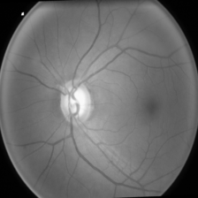

Web Nethralaya is an AI-driven, full-stack web platform designed to assist healthcare professionals in the early detection of Glaucoma and Retinopathy of Prematurity (ROP) through rapid, reliable analysis of eye fundus images.

Built with a lightweight HTML/CSS/JavaScript frontend and a robust Flask backend, the system leverages a custom-trained Convolutional Neural Network (CNN) developed using PyTorch to perform real-time predictions. Users can upload retinal images via a simple web interface and instantly receive diagnostic feedback powered by deep learning.

This platform was designed with a focus on speed, accuracy, and accessibility, making it suitable for clinical environments, screening camps, and research studies aiming to reduce preventable vision loss.

Key Features Custom-trained AI Model: CNN model (ResNet50-based) fine-tuned on fundus image datasets for Glaucoma and ROP detection.

Fast Frontend: Lightweight, responsive HTML5/CSS3/JavaScript frontend for a seamless experience.

Flask Backend: Python Flask server hosting the trained PyTorch model for inference.

Privacy Focus: No data storage. Images are processed in-memory and deleted post-inference.

Training Pipeline Included: Full Jupyter Notebook provided showing model building, training, evaluation, and visualization.

Tech Stack Frontend: HTML5, CSS3, JavaScript

Backend: Python, Flask, PyTorch

Libraries: Torchvision, Pillow, NumPy

📷 Sample Images from Model Pipeline

| After Preprocessing | GradCAM Heatmap |
|---------------------|-----------------|
|  |  |
Upload a fundus image ➔ Get real-time AI predictions!

📚 Notebook and Model Training The full model training process, including:

Dataset preprocessing

Model fine-tuning

Evaluation metrics (accuracy, F1 score)

GradCAM visualization experiments are available in the G_L.ipynb notebook!

Feel free to explore, reproduce, and retrain!